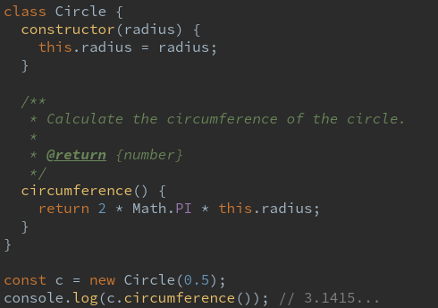

# PrismJS Darcula Theme

[](https://www.npmjs.com/package/prismjs-darcula-theme)
[](https://www.npmjs.com/package/prismjs-darcula-theme)

A syntax highlighting theme for [PrismJS] based on the Darcula theme from the [JetBrains] IDEs.

## Examples



Check out more examples and other languages on [GitHub pages](https://lucascorpion.github.io/prismjs-darcula-theme).

## Usage

### HTML

Download and include the compiled stylesheet in the `head` of your html:

```html
<link href="darcula.css" rel="stylesheet" />
```

### Gatsby

This theme can be used in Gatsby with [gatsby-remark-prismjs]. Simply install the package using:

```shell
npm install prismjs-darcula-theme
```

And add this line in `gatsby-browser.js`:

```js
import 'prismjs-darcula-theme/darcula.css';
```

## Development

Run `npm run docs:watch` to watch `darcula.scss` for file changes, compiling it to `docs/darcula.css`. To compile the file without watching for changes, use `npm run docs`. Open `docs/index.html` in your browser to view the results.

[PrismJS]: https://prismjs.com
[JetBrains]: https://www.jetbrains.com
[gatsby-remark-prismjs]: https://www.gatsbyjs.org/packages/gatsby-remark-prismjs
[gatsby-plugin-sass]: https://www.gatsbyjs.org/packages/gatsby-plugin-sass
